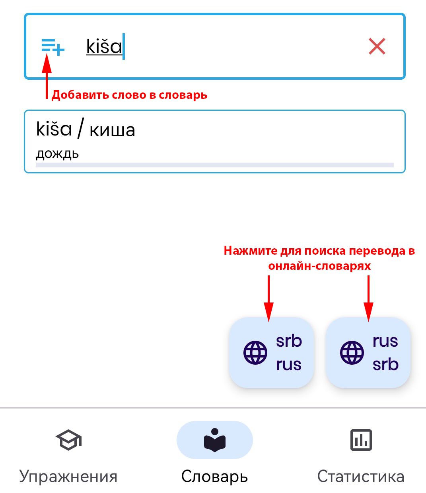

# Словарь

Приложение содержит встроенный словарь (который периодически пополняется при выходе
новых версий). Поэтому, вы можете пользоваться приложением даже при отсутствии интернета.

Чтобы найти слово в словаре, наберите его в строке поиска (можно вводить и на русском
и на сербском латиницей или кириллицей):

Если вы хотите добавить свое слово в словарь - нажмите на кнопку слева от введенного
слова:

Чтобы отредактировать слово в словаре - нажмите на него однократно коротким нажатием.

Если слова нет в словаре или вы хотите посмотреть другие варианты перевода - нажмите
кнопку (в зависимости от желаемого направления перевода) справа внизу экрана,
чтобы найти слово в Google- и Yandex-переводчиках:

Так же вы можете искать не только слова, но и целые фразы,
например:

Вы можете удалить слово из словаря свайпом влево:

Можете добавить слово в изучаемые (оно появится в упражнении "Новые слова") свайпом
вправо:

Зеленая полоса под словом показывает прогресс изучения слова. Вы можете начать учить
слово заново, если свайпнете его вправо:

